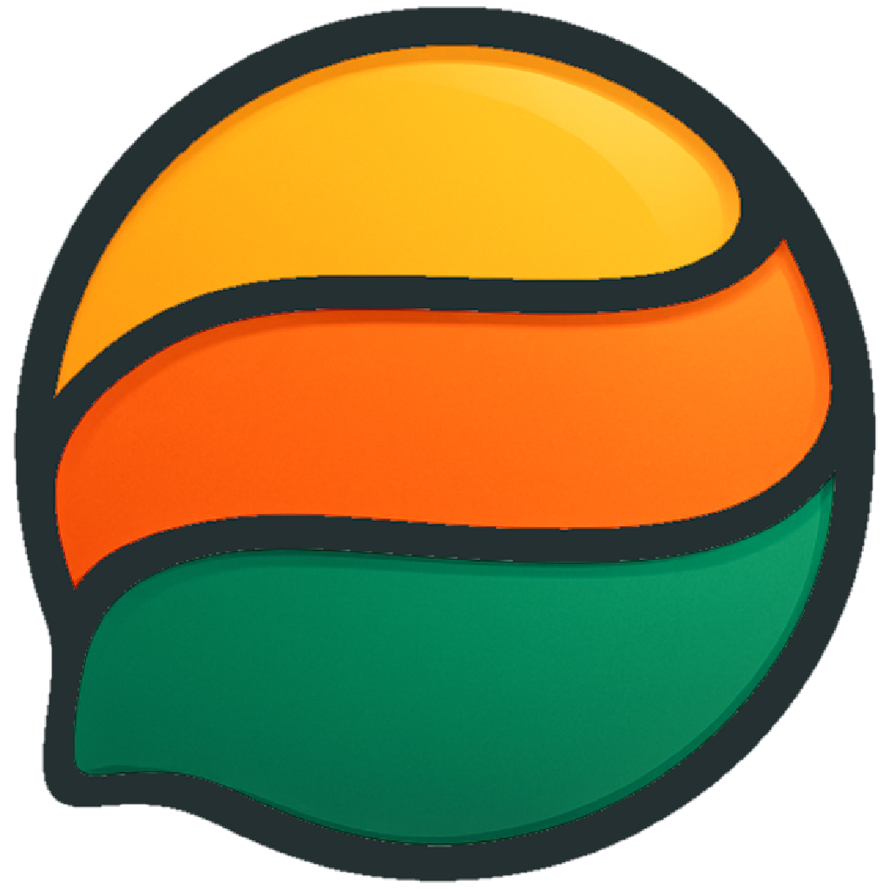

  

<h1 align="center">Fawas Pasture</h1>

  <a href=""><strong>Download</strong></a> •
  <a href=""><strong>Website</strong></a> •
  <a href=""><strong>Documentation</strong></a> •
  <a href=""><strong>Release Notes</strong></a>

  
  

---

## 🐑 About Pasture

Pasture is a productivity-focused browser designed for software and game developers. The goal is to offer a clean, customizable interface, integrated tools, and optimized performance to streamline workflows, without infringing on the needs of non-developers.

---

## 🌍 Compatibility

Built with Electron, Pasture supports **Windows**, **Mac**, and **Linux**. Windows is fully tested, with Mac and Linux support in development.

- **Windows**: Fully tested ✅
- **Mac**: In progress 🛠️
- **Linux**: In progress 🛠️

---

## 🚀 Installation

1. Visit the [Download](#) page.
2. Select your operating system.
3. Follow the setup instructions in the [Documentation](#).

---

## 🤝 Contribution

We welcome contributions! Check out our [Contributing Guide](#) to get started.

---

  <strong>Join the Pasture community Discord server to discuss changes, and / or make issues on this GitHub page.</strong>

